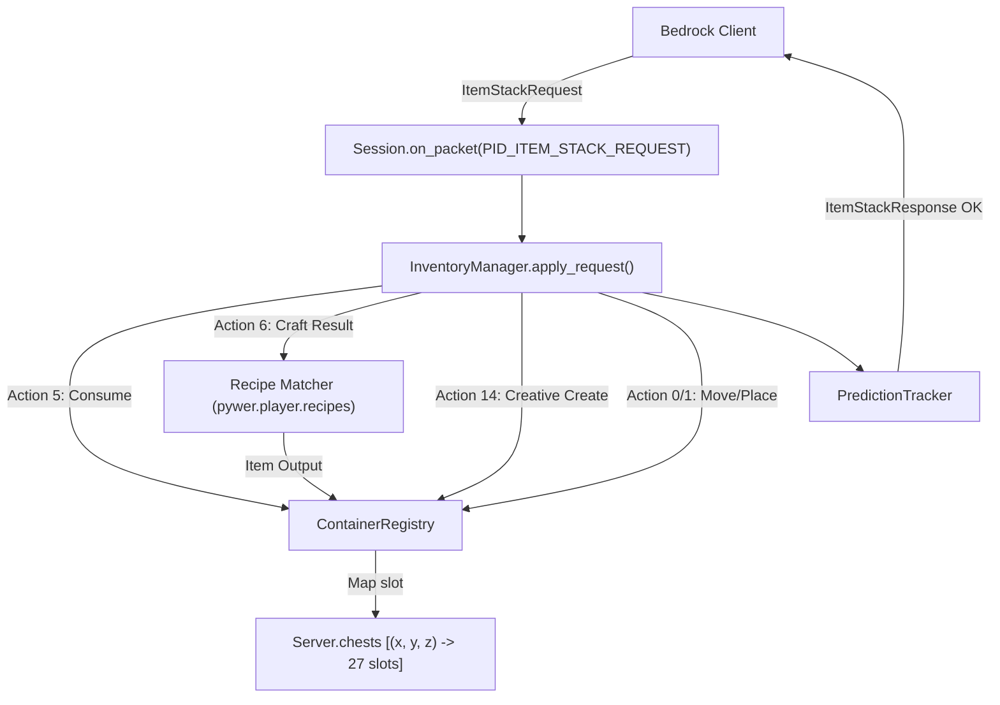

# Architectural Design: Inventory & Container System Hardening

## 1. Overview & Goals

In Minecraft Bedrock 1.20+, inventory modifications are driven by client-side item stack predictions and server-authoritative request reconciliation (`ItemStackRequestPacket`). The server validates actions, mutates backing item lists, tracks prediction changes, and returns `ItemStackResponsePacket` containing updated stack IDs.

### Key Problems Addressed
1. **Crafting & Creative Mode Desync/Rejection:** Bedrock sends `ACTION_CONSUME` (action 5), `ACTION_CREATE_OUTPUT` (action 6), and `ACTION_CREATIVE_CREATE` (action 14). `InventoryManager.apply_request` currently rejects these with `InventoryError`, forcing complete inventory rollbacks.
2. **Missing UI Container Slot Mapping:** `ContainerRegistry` only registers `cursor` and `crafting2x2`. Crucial slots like `created_output` (net slot 50) and `crafting3x3` (net slots 32–40) are unmapped, causing slot resolution to fail with `unknown slot`.
3. **No Interactive Block Containers:** Right-clicking a `crafting_table` or `chest` attempts to place a block rather than opening the interactive container screen. There is no world-level chest storage.
4. **False Stack ID Mismatch on Empty Slots:** Placing items into empty slots (`ITEM_AIR`) can trigger spurious mismatch errors when client stack IDs are 0 or negative.

### Goals
- Fully support crafting in both 2x2 player grid and 3x3 workbench grid.
- Enable creative mode item selection (`CREATIVE_CREATE`) without desyncs.
- Implement server-side block containers: Crafting Table workbench window and Chest container window with world persistence.
- Provide a modular recipe engine in `pywer.player.recipes` covering core survival recipes.
- Maintain 100% test coverage and PEP 8 conformity across all inventory modules.

---

## 2. Architecture & Data Flow



---

## 3. Subsystem Specifications

### 3.1 Complex UI Container Slot Mapping

In [`pywer/player/containers.py`](file:///c:/Users/Mani/Desktop/Pywer/pywer/player/containers.py):
- Define standard Bedrock net slot constants:
  - `UI_CURSOR_SLOT = 0`
  - `UI_CREATED_OUTPUT_SLOT = 50`
  - `UI_CRAFTING2X2 = {28: 0, 29: 1, 30: 2, 31: 3}`
  - `UI_CRAFTING3X3 = {32 + i: i for i in range(9)}`
- Register `created_output` in `ContainerRegistry.complex`:
  ```python
  "created_output": ComplexContainer({UI_CREATED_OUTPUT_SLOT: 0}, 1)
  ```
- Register `crafting3x3` in `ContainerRegistry.complex`:
  ```python
  "crafting3x3": ComplexContainer(UI_CRAFTING3X3, 9)
  ```
- Update `canonical_container(cid)` and `resolve_slot(cid, slot)` in `Session` to recognize `UI_CREATED_OUTPUT` and `UI_CRAFTING_INPUT` across both 2x2 and 3x3 modes.

### 3.2 Action Pipeline Expansion (`InventoryManager`)

In [`pywer/player/inventory_manager.py`](file:///c:/Users/Mani/Desktop/Pywer/pywer/player/inventory_manager.py):
- **`ACTION_CONSUME` (type 5):**
  - Schema: `(_, count, src)`
  - Action: Resolves `src` slot, verifies `current_count >= count`, decrements slot item by `count`.
  - Returns `{(id(lst), idx)}`.
- **`ACTION_CREATE_OUTPUT` (type 6):**
  - Schema: `(_, reps)`
  - Action: Inspects player's active crafting grid (2x2 if in main inventory, 3x3 if workbench open), evaluates matching recipe via `match_recipe(grid)`, and puts `(item_id, count * reps, meta)` into `created_output.items[0]`. If no recipe matches, uses fallback or client prediction.
  - Returns `{(id(created_output.items), 0)}`.
- **`ACTION_CREATIVE_CREATE` (type 14):**
  - Schema: `(_, item_id, reps)`
  - Action: Verifies player is in creative mode (`self.session.gamemode_is_creative()`), places `item_tuple(item_id, reps, 0)` into `created_output.items[0]`.
  - Returns `{(id(created_output.items), 0)}`.
- **Lenient Empty-Slot Prediction Check:**
  - In `_check_stack_id(ref, client_stack_id)`: if the slot currently contains `ITEM_AIR` (item_id 0) and `client_stack_id <= 0`, allow the operation to proceed without throwing a mismatch exception.

### 3.3 Recipe Engine (`pywer.player.recipes`)

Create [`pywer/player/recipes.py`](file:///c:/Users/Mani/Desktop/Pywer/pywer/player/recipes.py):
- Supports shaped and shapeless recipes.
- Core Survival Recipes:
  - 1 Log (any species) $\to$ 4 Planks
  - 4 Planks (2x2) $\to$ 1 Crafting Table (id 58)
  - 2 Planks (vertical) $\to$ 4 Sticks (id 280)
  - 1 Coal / Charcoal + 1 Stick $\to$ 4 Torches (id 50)
  - 3 Planks + 2 Sticks $\to$ Wooden Pickaxe (id 270)
  - 2 Planks + 1 Stick $\to$ Wooden Sword (id 268)
  - 3 Planks + 2 Sticks $\to$ Wooden Axe (id 271)
  - 1 Plank + 2 Sticks $\to$ Wooden Shovel (id 269)
  - 8 Planks (ring) $\to$ 1 Chest (id 54)

### 3.4 Block Containers: Workbench & Chests

1. **Interaction Detection in `Session.try_place_block`:**
   - When `ACTION_CLICK_BLOCK` arrives at block `pos` and `not self.sneaking`:
     - If block is `"crafting_table"`:
       - Calls `self.open_crafting_table(pos)`.
       - Returns `True` (cancels placement).
     - If block is `"chest"`:
       - Calls `self.open_chest(pos)`.
       - Returns `True` (cancels placement).
2. **Server Chest Storage (`Server.chests`):**
   - Stored in `Server`: `self.chests = {}` mapping `(x, y, z) -> [ITEM_AIR for _ in range(27)]`.
   - Persisted in `WorldStorage` under `chests` section.
   - When a chest block is broken (`Server.break_block`):
     - Dumps all non-air items stored in `self.chests[(x, y, z)]` as floating item entities.
     - Deletes entry from `self.chests`.

---

## 4. Testing & Verification Strategy

1. **Unit Tests:**
   - `tests/test_recipes.py`: Verify shapeless and shaped recipe matching and output counts.
   - `tests/test_inventory_actions.py`: Test `ACTION_CONSUME`, `ACTION_CREATE_OUTPUT`, `ACTION_CREATIVE_CREATE`, and empty-slot prediction tolerance.
   - `tests/test_block_containers.py`: Test workbench window open/close, chest storage persistence, and chest destruction drop logic.
2. **Regression & Smoke Test:**
   - Verify all 12 existing tests pass with 0 regressions.
   - Run server smoke test and verify network protocol packet integrity.
